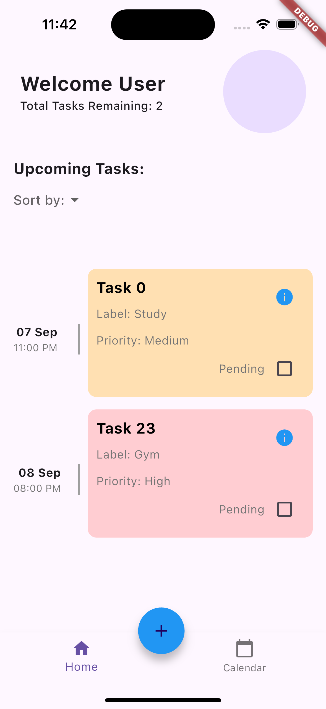
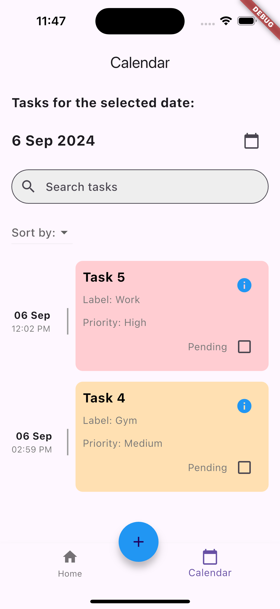
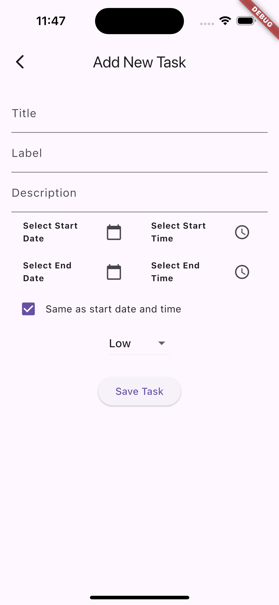
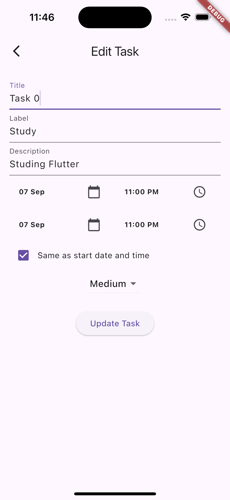
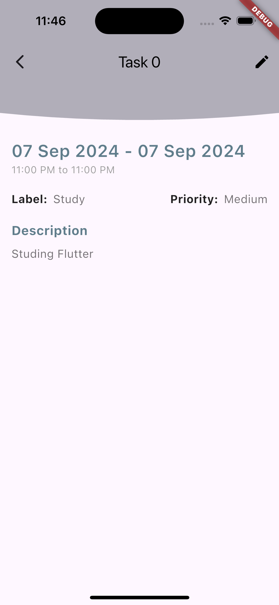
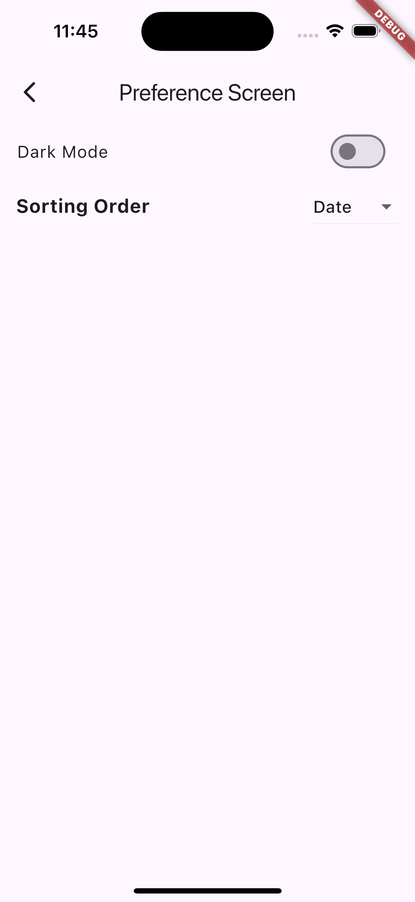

# Task Manager App

## Overview

The Task Manager App is a Flutter-based application designed to help users manage and organize their tasks. The app includes features for adding, updating, and deleting tasks, sorting tasks by different criteria, and toggling between light and dark modes. It also offers a detailed view of tasks and supports persistent storage using SQLite.

## Features

- Add, update, and delete tasks
- View task details 
- Sort tasks by status, date, or priority
- Toggle between light and dark modes
- Persistent storage with SQLite

## Screenshots








## Installation

### Prerequisites

Make sure you have the following installed on your machine:

- **Flutter SDK**
- **Dart SDK**
- **An IDE**

### Cloning the Repository

Open your terminal or command prompt and run the following command to clone the repository:

```bash
git clone https://github.com/nikhal.regi343/task_manager_app.git
```

### What left to Implement?

- local notification.
- when pressed FAB and we add some detail but we pressed the back button it should store the data within the labels for a while
- to add more functionality to the dismissible(like edit on right swipe and delete on left)
- UI of the description screen
